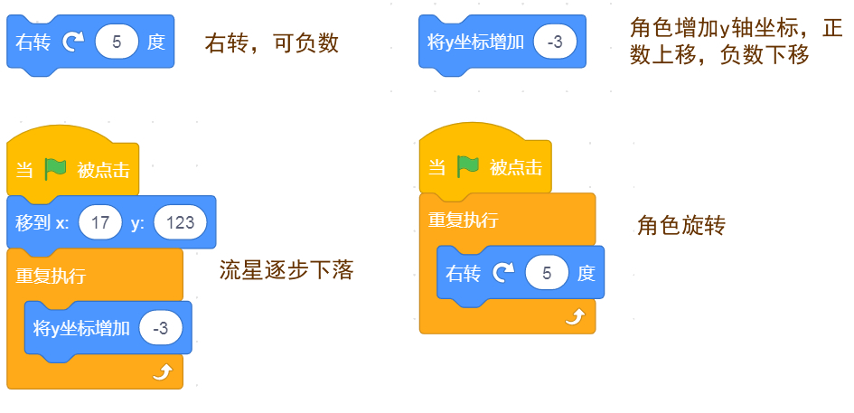
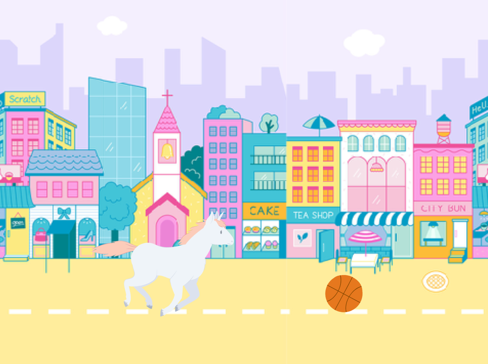
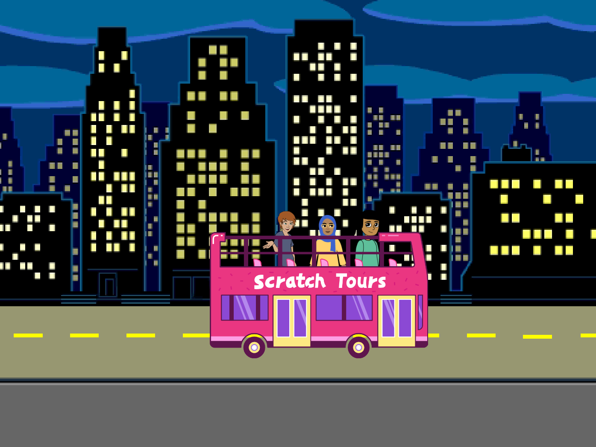
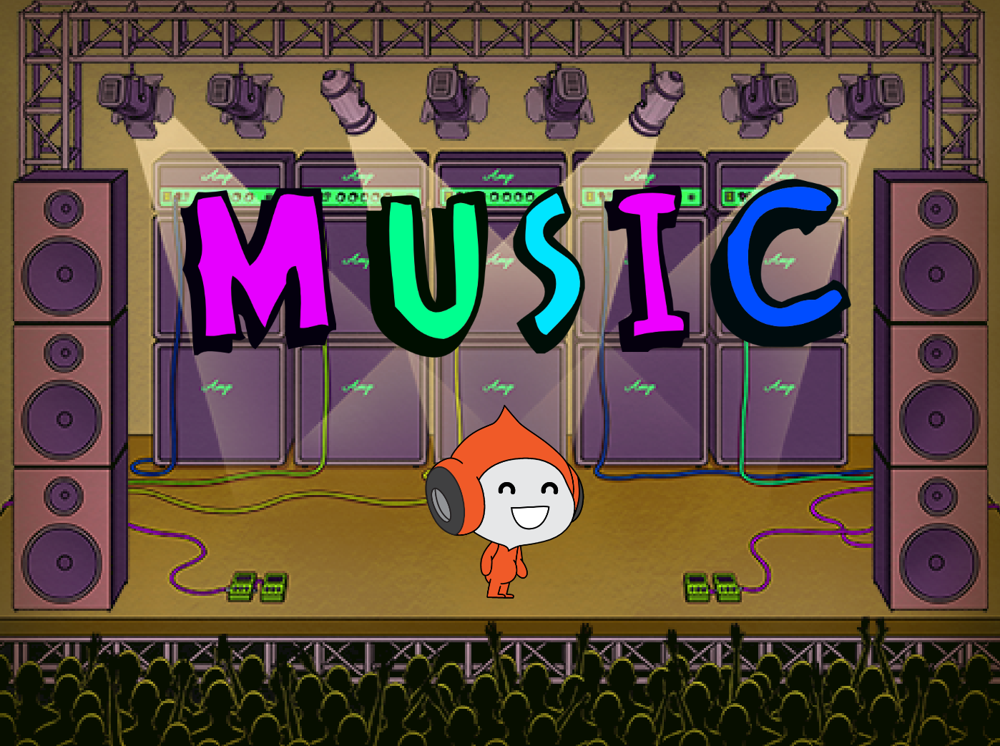
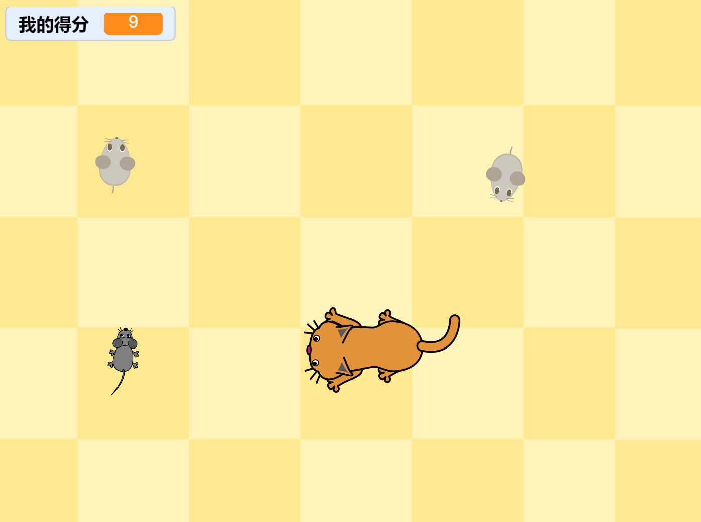
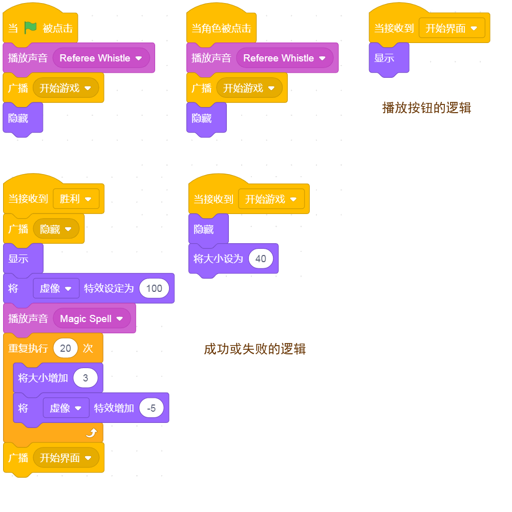
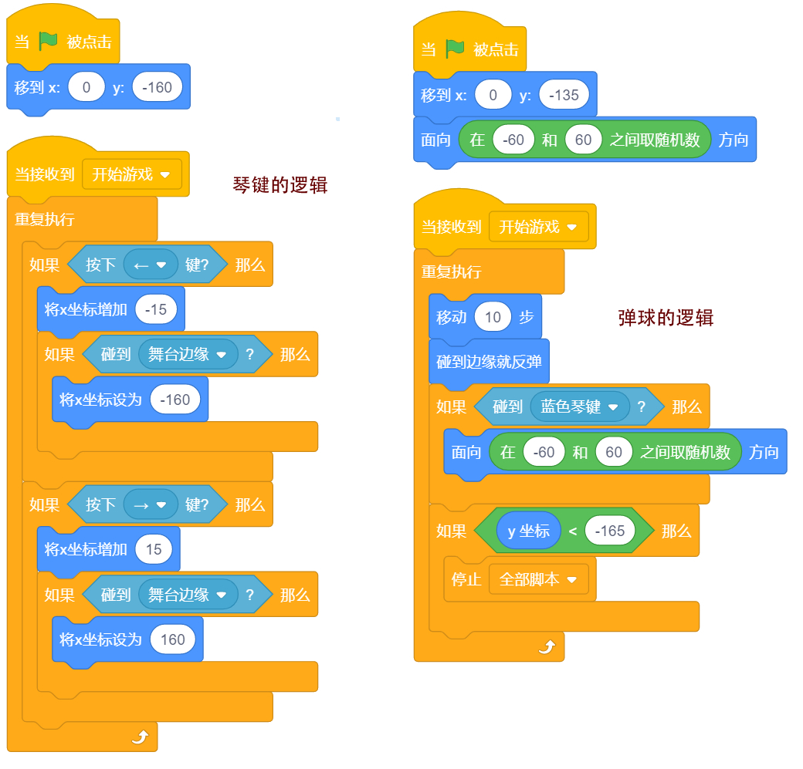
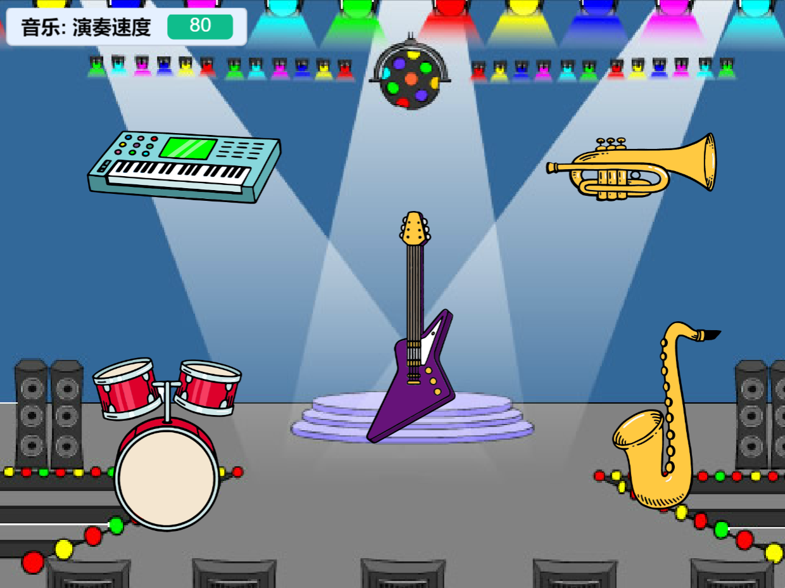
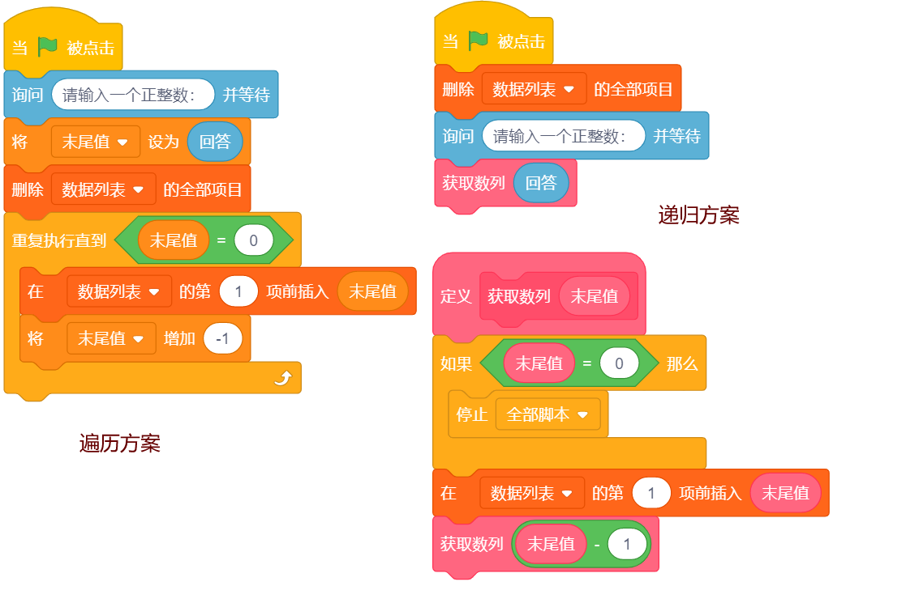
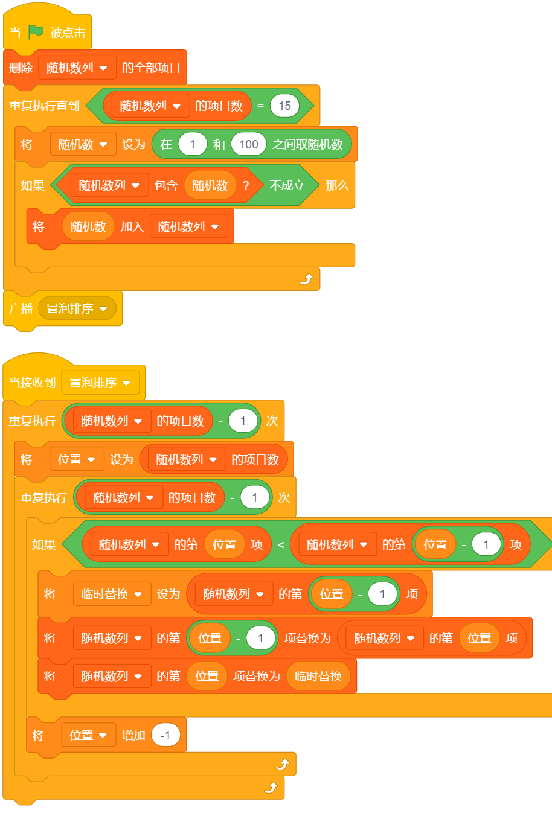

# 02. Scratch软件入门

主讲老师 - 李炎恢

### 1. 模式选择

- 讲课默认选择PC端Scratch讲解，而学生当然也采用PC端的软件，和老师同步即可。
  - 下载地址：https://scratch.mit.edu/（含Mac版和Windows版）
  - 如果你访问不了以上地址，届时提供国内的下载渠道，请期待~
  - 在第一节课，已经说明了Web端软件的使用方法，由于课程中不使用，这里不再赘述。
- 课程适龄的小朋友是多大的？课程是如何规划的呢？
  - 理论上，Scratch适合小学2年级至小学4年级，当然实际上根据小朋友的能力浮动调节。
  - 课程分为三个类别：基础篇、高难度扩展篇和竞赛真题篇，做成三套独立课程。

​		

### 2. 主界面功能

###  3. 简单操作

- **缩小**、**方法**和**全屏**舞台区，展示一下区别；
- 载入**角色**、背景的方式，注意角色有多种造型；

- 切换**代码**、**造型**和**声音**的区别，并载入对应的角色；

- 了解**扩展积木**的内容和使用方法；

- **代码积木区**的简单使用；

- 创建一个文件夹，用于保存自己的作品，学会**保存**和**载入**作品。

# 03. 海底世界.移动

主讲老师 - 李炎恢

### 1. 故事脚本

> **深邃的海底！**
> **有着凶猛无比的鲨鱼！**
> **也有着色彩斑斓的小丑鱼！**

### 2. 知识点概况

### 3. 设计实战

- 载入背景“**水下1**”，选择背景图库里的分类里“**水下**”可找到。

- 载入角色“**鲨鱼**”，将它拖到右下角处即可，载入“**小丑鱼**”。

- 选择代码“**事件**”中的**当小绿旗被点击**，来执行后续的动画设置。

- 比如：**重复执行**，**移动3步**，**遇到边缘就反弹**，以及**将旋转方式设为**：左右旋转。

# 04. 海底世界.造型

主讲老师 - 李炎恢

### 1. 故事脚本

> **海底的河床！**
> **有着张牙舞爪的章鱼！**
> **和闪烁耀眼的水母！**

### 2. 知识点概况

### 3. 设计实战

- 载入上一节课**移动**的案例。
- 将鲨鱼和小丑鱼更换一下**造型**。
- 添加新角色“**水母**”和“**章鱼**”，并通过切换造型来改变自身形象。
- 设置章鱼**置后**，来表现它在鲨鱼的后面。
- 设置水母**大小**，来表现它在远处。
- 默认切换的间隔时间太快了，设置**等待**时间来调节。

# 05. 侏罗纪公园.面向

主讲老师 - 李炎恢

### 1. 故事脚本

> **几亿年前！**
> **侏罗纪时代！**
> **有着大型而凶猛的恐龙！**

### 2. 知识点概况

### 3. 设计实战

- 载入背景“**热带草原**”。

- 载入角色“**火龙**”、“**梁龙**”、“**剑龙**”、“**霸王龙**”，并设置造型变换。

- 在剑龙和霸王龙，使用两种方法来改变它们的**面向**问题。

# 06. 小鸡啄米.坐标

主讲老师 - 李炎恢

### 1. 故事脚本

> **早起的小鸡有米吃！**
> **太阳刚刚升起！**
> **小鸡就出屋觅食了！**

### 2. 知识点概况

### 3. 设计实战

- 载入背景“**农场**”。

- 载入角色“**小鸡**”，并使用**定位坐标**的方式，让其开始时固定在某处。

- 然后先确定一个坐标地点，使用**1秒滑动**的方式移动到指定的坐标。

- 最后通过**两次循环**，实现**啄米**的过程。

# 07. 小鸡**啄米**.改造型

主讲老师 - 李炎恢

### 1. 故事脚本

> **略。**

### 2. 知识点概况

### 3. 设计实战

- 在“**小鸡**”造型里，复制第一个造型，并修改成两腿叉开的造型。

- 并通过**重复循环10次**，对应滑动的1秒进行匹配。

- 然后向前移动也是如此，需要重复对应的次数，并**匹配间隔等待**的时间。

- 最后将**朝向**问题解决，并在初始化时设置朝向。

# 08. 流星雨.旋转

主讲老师 - 李炎恢

### 1. 故事脚本

> **夜晚的天空！**
> **繁星点点！**
> **我们向流星许个愿吧！**

### 2. 知识点概况

### 3. 设计实战

- 选择繁星点点“**太空**”背景。

- 选择“**星星**”角色，如果找不到，搜搜：**star**即可。

- 设置角色重复执行“**右转**”，可以让其自转，**负数**可向左旋转。

- 通过重复执行，将**y坐标增加**或减少，可设置角色向上或向下移动。

# 09. 流星雨.侦测

主讲老师 - 李炎恢

### 1. 故事脚本

> 略。

### 2. 知识点概况

### 3. 设计实战

- 想要让星星重复下落，必须让星星在底部**返回初始位置**。

- 通过判断星星是否**触底**，触底后**隐藏**，避免返回生硬。

- 多个星星，设置返回期间不同的**等待时间**，创造时间差。

- 最终实现**显示**，再继续下落，如此往返。

# 10. 跋山涉水.背景

主讲老师 - 李炎恢

### 1. 故事脚本

> **勤劳的食品车！**
> **起早贪黑，跋山涉水！**
> **将可口的食物运送到客人手中！**

### 2. 知识点概况

### 3. 设计实战

- 载入四个背景，体现**跋山涉水**的主题，最后一张用“**城市夜晚**”。
- 载入**食品**分类的“**小汽车**”，让它穿越每个背景。
- 背景切换，使用“**下一个背景**”即可切换，**判断**小汽车到达指定位置后切换。
- 切换背景后，再还原到初始坐标即可。
- 造型切换，采用**0.4秒**停顿即可。

# 11. 跋山涉水.声音

主讲老师 - 李炎恢

### 1. 故事脚本

> 略。

### 2. 知识点概况

### 3. 设计实战

- 在背景中，设置一个**可循环**的背景音乐，**等待播放完**再循环下一次。
- 在食品车出场时，初始化音效，比如音量30%，音调设置80或90。
- 每次**场景开头**，播放一下喇叭的滴滴，当然，初始化的时候，也要播放一次。

# 12. 捕获蝴蝶.随机

主讲老师 - 李炎恢

### 1. 故事脚本

> **春游去啦！**
> **翠绿的树林中有好多蝴蝶！**
> **我们一起来抓蝴蝶吧！**

### 2. 知识点概况

### 3. 设计实战

- 载入“**树林**”背景。
- 选择“**蝴蝶**”角色，设置开始**随机**安置一个位置。
- 在运动中，采用**旋转随机**和**移动随机**，造成自由飞舞的状态。
- 造型切换后，**复制**三个角色即可。

# 13. 捕获蝴蝶.鼠标

主讲老师 - 李炎恢

### 1. 故事脚本

> **略。**

### 2. 知识点概况

### 3. 设计实战

- 本节是目前比较难理解的部分了，适合多多思考。
- 角色“**帽子**”，需要进行**改造型**操作，方便实现**按下去**的过程。
- 角色“**蝴蝶**”，先判断**碰“帽子”**，然后再增加一个**按下鼠标**，循序渐进理解。

# 14. 师生问候.表达

主讲老师 - 李炎恢

### 1. 故事脚本

> **老师的办公室！**
> **王二狗正在和班主任对话！**
> **询问着上周的考试情况！**

### 2. 知识点概况

### 3. 设计实战

- 使用外观下的“**表达**”，有两种形式等待后消失，和不等待。
- 载入背景“**房间**”，并载入两个角色，都在**奇幻**里。
- 通过**切换造型**和等待时间的差，来实现兑换互动。
- 在更多的对话下，就很难精确计算等待时间的差了。

# 15. 师生问候.广播

主讲老师 - 李炎恢

### 1. 故事脚本

> **略。**

### 2. 知识点概况

### 3. 设计实战

- "**广播**"和“**收到广播**”，两个代码积木可以自动等待对方播放完再进行自我播放。
- 所以，这种方法就直接取代等待时间，来**精确设置**时间差。

# 16. 马戏团表演.拼接

主讲老师 - 李炎恢

### 1. 故事脚本

> **游乐场的步行街！**
> **马戏团的马儿正在表演！**
> **它今天的节目是：跨越篮球！**

### 2. 知识点概况

### 3. 设计实战

- 如果想要背景实现移动的效果，需要将**背景作为角色**来载入。
- 然后通过让背景作为角色，向左边移动，并判断最后**最右边的坐标**返回初始位置。
- 在角色编辑中，在溢出的左右，都**复制**一张背景图，这样就覆盖了切换时的空白。

# 17. 马戏团表演.变量

主讲老师 - 李炎恢

### 1. 故事脚本

> **略！**

### 2. 知识点概况

### 3. 设计实战

- **篮球**角色，没有新知识点，在坐标到50时给小白马发送广播，让它跳跃即可。
- 小白马采用了变量实现了**减速度**和加速度的功能，这是个难点，可以先用变量设置跳跃数来理解。
- 加速度和减速度，就是让上升或下降的速度逐步变快或变慢的移动。

# 18. 火箭升空.加速

主讲老师 - 李炎恢

### 1. 故事脚本

> **未来的世界！**
> **人形机器人正在发射火箭！**
> **倒计时开始后，火箭升空远航！**

### 2. 知识点概况

### 3. 设计实战

- 载入必须的角色和背景，“**机器人**”、“**火箭**”、“**太空**”。
- **倒计时**功能，采用**变量**结合**重复执行**，再加上**外观表达**实现。
- **加速度**，是复习的上一课的**减速度**而来。

# 19. 火箭升空.切换

主讲老师 - 李炎恢

### 1. 故事脚本

> **略！**

### 2. 知识点概况

### 3. 设计实战

- 切换到“**星空**”背景，此时要**隐藏**掉升空的火箭和机器人。
- 在远航的火箭，编辑它的面向为右，在循环移动时，再逐步**减少**大小。
- 注意，在循环里发送广播，要**停止**这个循环脚本，否则会一直发送广播。

# 20. 乘坐公交.虚像

主讲老师 - 李炎恢

### 1. 故事脚本

> **城市的夜晚！**
> **是996们下班的时候！**
> **乘坐着末班车，回到温馨的家！**

### 2. 知识点概况

### 3. 设计实战

- 首先，导入背景“**城市的夜晚**”，然后导入角色“**公交车**”，以及三个人物角色。
- 大概摆放位置之后，需要对公交车进行**造型编辑**，分别编辑出还有三个人物角色。
- 当运动时，公交车通过**减速度**来靠站。
- 当上车时，人物通过**虚像**来模拟上车。

# 21. 乘坐公交.计时器

主讲老师 - 李炎恢

### 1. 故事脚本

> **略！**

### 2. 知识点概况

### 3. 设计实战

- 背景移动的方法，在马戏团重点研究过。这里不在赘述。
- 主要是**计时器**，当动画运动时，计时器就开始计时，我们可以为此做判断。
- 如何停止背景移动，通过**停止这个脚本**来实现。

# 22. 乘坐公交.收尾

主讲老师 - 李炎恢

### 1. 故事脚本

> **略！**

### 2. 知识点概况

### 3. 设计实战

- 当背景移动停止时，我们发送一个下车的广播。
- 公交车接受到广播后，逐步让乘客下车，通过变换公交车造型实现。
- 并且给每个人发送回家的广播，需要等待接受广播并执行完返回后继续往下执行。
- 最后让公交车移动到最后边，加上加速度和虚像效果。

# 23. 音乐节广告.颜色

主讲老师 - 李炎恢

### 1. 故事脚本

> **哟哟哟！**
> **盛大的音乐节开幕啦！**
> **带着激情，一起嗨，一起哟！**

134134134134134

### 3. 设计实战

- 背景的灯光闪烁，直接使用**外观颜色**的变换即可。
- 广告语有三个效果：**大小变换**、**虚像变换**、颜色变换。

# 24. 圣诞大转盘.上传

主讲老师 - 李炎恢

### 1. 故事脚本

> **圣诞节到了！**
> **我们做一个圣诞节的礼物大转盘！**
> **看看谁的运气最好！**

### 2. 知识点概况

### 3. 设计实战

- 本节课，所有的素材都是第三方的，也就是自己找的。
- 而且素材并未处理完整，我们需要在造型区进行设置处理。
- 核心的操作有：**上传造型**、**组合造型**、**复制粘贴造型**、**更改大小**、**旋转**。

# 25. 圣诞大转盘.颜色碰撞

主讲老师 - 李炎恢

### 1. 故事脚本

> **略！**

### 2. 知识点概况

### 3. 设计实战

- 按钮需要在最前面，并且当**角色点击**后发送**广播**。
- 大转盘可以先设置普通旋转，然后过渡到**减速度**提升体验。
- 核心功能，**颜色碰撞**检测，要调试谁碰谁，最好在按钮头上涂上指定颜色。

# 26. 走动的钟表.绘图

主讲老师 - 李炎恢

### 1. 故事脚本

> **滴答滴答，时间在一分一秒的走过！**
> **我们一定要珍惜时间！**
> **那么，就做一个能够运转的钟表吧！**

### 2. 知识点概况

### 3. 设计实战

- 本节课，所有素材均不是第三方，也不是自有库里的(或部分)。
- 我们要脱手绘制一个钟表，并且在下一节课通过积木代码运动起来。
- 注意：1.钟表盘、和针脚是分开绘制的；2.注意中心点的问题。

# 27. 走动的钟表.方向

主讲老师 - 李炎恢

### 1. 故事脚本

> **略！**

### 2. 知识点概况

### 3. 设计实战

- 60秒是一分钟，故：每转一圈就给分针发送广播，让它走一针。
- 360度是一圈，一圈只有60秒，故：一针就是6度。
- 分针走一圈是60分钟，表盘只有12个小时，那么1针(6度) x 12小时 = 72度。
- 也就是说，分针每走72度，时针走一针。给出具体方向：162、-126、-54、18、90。
- 在判断秒针的方向时，为何是84度而不是90度，这里是为了一个时间差，判断前一个度数。
- 滴答的声音，通过截取长声音中的某一段生成的。

# 28. 猫捉老鼠.按键

主讲老师 - 李炎恢

### 1. 故事脚本

> **家里地板上好久没人打扫！**
> **来了一些不速之客，在玩具鼠里混进了真老鼠！**
> **我们让猫猫去捉住它吧！**

### 2. 知识点概况

### 3. 设计实战

- **按键**：通过侦测按下了键盘中的某一个键来执行某些行为。

- 猫猫在四个方向设置了按键行为，而**任意键**是为了在造型变换中兼容斜角的方向（但具有负面影响）。

- 老鼠分为真老鼠，和两个电子老鼠，它们的方案和之前蝴蝶的方案一致。

  

# 29. 猫捉老鼠.规则

主讲老师 - 李炎恢

### 1. 故事脚本

> **略！**

### 2. 知识点概况

### 3. 设计实战

- 规则一：当真老鼠碰到猫猫时，加一分。
- 规则二：当电子鼠碰到猫猫时减两分。
- 规则三：当分数小于1时，游戏失败。
- 规则四：当分数大于19时，通关游戏。

# 30. 猫捉老鼠.首尾

主讲老师 - 李炎恢

### 1. 故事脚本

> **略！**

### 2. 知识点概况

### 3. 设计实战

- 我们将播放权限，都交给了播放按钮，而不是小绿旗。
- 通过广播**开始游戏**来让动画进行播放。
- 胜利和失败，单独做两个角色显示或隐藏，并广播到播放按钮处。

# 31. 水果忍者.克隆

主讲老师 - 李炎恢

### 1. 故事脚本

> **忍者村正在进行中忍考试！**
> **今天的考试题目是，切水果！**
> **让我们避开炸弹，尽情的切切切！**

### 2. 知识点概况

### 3. 设计实战

- 将**木板**背景载入，将**苹果**角色载入，并上传**苹果_切**的造型。
- 所谓**克隆**：就是将本体复制出一个或多个一模一样的角色，并且这个角色想对独立。
- **当作为克隆体启动**：就是克隆体复制出来后，执行对应代码，相当于小绿旗的意思。
- **本体不参与行为**：我们这里本体只负责随机位移和复制自己，并不参与切水果的过程。

# 32. 水果忍者.私有变量

主讲老师 - 李炎恢

### 1. 故事脚本

> **略！**

### 2. 知识点概况

### 3. 设计实战

- 当一个克隆体结束了自己的运动，我们通过**删除此克隆体**来隐藏它。
- 由于匀速运动不能模拟自由落体，所以我们需要通过变速来实现。
- 而变速后虽然实现了自由落体，但出现了**变量冲突**的问题。
- 这是由于变量是**共享**的，我们只要设置**私有变量**，就能解决互相干扰的问题了。

# 33. 水果忍者.判断

主讲老师 - 李炎恢

### 1. 故事脚本

> **略！**

### 2. 知识点概况

### 3. 设计实战

- 我们可以先判断**碰到鼠标**后，来尝试切水果，然后再调整成**水果刀**体会区别。
- 必须在触碰水果刀后，再判断是否为水果的**第一造型**，否则会不断累计分数。
- 炸弹的逻辑会不太一样，它需要**立刻爆炸**后消失，当然：在随机等待出现时间要更长。
- 在背景区，**初始化变量**并判断被炸的次数，然后停止游戏。
- 这里**停止游戏**的方式为：1.发送广播去告知其它角色停止；2.并停止这个脚本，让其不再重复判断。

# 34. 水果忍者.统计

主讲老师 - 李炎恢

### 1. 故事脚本

> **略！**

### 2. 知识点概况

### 3. 设计实战

- 和猫捉老鼠一样，把开始小绿旗取消，用广播来控制播放。
- 忍者来触发播放的控制，并做一个开始的引导。
- 当结束游戏时，忍者不要停止脚本，并通过**连接符**来统计得分。
- 其它角色停止脚本的方式为：**该角色的其他脚本**，意味停止角色这个脚本的其它所有脚本。

# 35. 英文打字.复习

主讲老师 - 李炎恢

### 1. 故事脚本

> **一年一度的打字比赛开始啦！**
> **那么，我们制作一个打字游戏！**
> **比一比，谁的分数高！**

### 2. 知识点概况

### 3. 设计实战

- 本节课，是基于猫捉老鼠以及水果忍者案例的复习。

- 核心功能包括：克隆的使用，以及按键的触发。

  

# 36. 英文打字.倒计时

主讲老师 - 李炎恢

### 1. 故事脚本

> **略。**

### 2. 知识点概况

### 3. 设计实战

- 这里的一个新知识：倒计时时，通过**向上取整**来获取整数。

- 向上和向下就是四舍五入的意思，可以单独尝试获取结果。

- 最后用连接符统计得分即可。

  

# 37. FlappyBird.开局

主讲老师 - 李炎恢

### 1. 故事脚本

> **鸟儿都是渴望飞翔的！**
> **我们来制作一款穿越障碍的游戏！**
> **比一比，谁能得到最高分！**

### 2. 知识点概况

### 3. 设计实战

- 这个小游戏早年特别火爆的一款小游戏，素材都是现成的。

- 我们需要分三节课去完成，没有新知识点，都是不同逻辑的组合。

- 开局，我们要做一个随机的场景（四个），以及标题、提示、小鸟。

- 地面的移动，和之前的背景移动是一个道理。

  

# 38. FlappyBird.障碍

主讲老师 - 李炎恢

### 1. 故事脚本

> **略。**

### 2. 知识点概况

### 3. 设计实战

- 当按下**空格**按键后，所有提示将消失，并发送开始游戏广播。

- 障碍主要是水管，通过**克隆**的方式移动，并随机产生空隙的位置。

- 最后，让水管**隐藏**并删除克隆。

  

# 39. FlappyBird.飞跃

主讲老师 - 李炎恢

### 1. 故事脚本

> #### **略。**

### 2. 知识点概况

### 3. 设计实战

- 按下空格键，改成可以实现脚本停止的方式，避免不断激活广播。

- 小鸟的飞翔，通过对应的公式来使其更加的平滑。

- 监听小鸟碰到水管和地面，暂时停止脚本。

  

# 40. FlappyBird.音效

主讲老师 - 李炎恢

### 1. 故事脚本

> **略。**

### 2. 知识点概况

### 3. 设计实战

- 本节主要是给飞翔的小鸟设置音效；
- 包括飞翔时的音效、得分时的音效、撞倒柱子的音效。

# 41. FlappyBird.计分

主讲老师 - 李炎恢

### 1. 故事脚本

> **略。**

### 2. 知识点概况

### 3. 设计实战

- 可以将背景的初始化，直接转移到结束窗口的角色上，方便管理；
- 通过积木来控制**显示和隐藏变量**，更加清晰；
- 最终得分显示在中间，将纪录得分转移到最终得分上；

# 42. 弹球游戏.弹击

主讲老师 - 李炎恢

### 1. 故事脚本

> **汉堡、沙拉、卷饼、薯条！**
> **都是特别畅销的快餐食品！**
> **那么，我们通过弹球去获取吧！**

### 2. 知识点概况

### 3. 设计实战

- 引入第三方“**天空**”的背景；
- 使用“**琴键**”，并编辑角色成想要的造型；
- 定位初始化的琴键和弹球位置；
- 设置开始游戏的广播，可以临时在背景区设置；
- 弹球和琴键的具体逻辑，如上图；

# 43. 弹球游戏.复制

主讲老师 - 李炎恢

### 1. 故事脚本

> **略**

  

### 2. 知识点概况

### 3. 设计实战

- 引入所有的快餐食品，并**调整大小**一致；
- 设置一个**克隆母体**，并隐藏；
- 创建三个变量x、y、个数，用于设置坐标和复制个数；
- 通过坐标来实现复制的角色进行两行的布局；

# 44. 弹球游戏.关卡

主讲老师 - 李炎恢

### 1. 故事脚本

> **略**

### 2. 知识点概况

### 3. 设计实战

- 引入关卡的数字角色：1，2，3；
- 设置相关特效，比如开场大小变小，并设置虚像透明度；
- 将背景的广播：开始游戏移植到关卡角色中去；
- 设置得分系统，碰撞后删除克隆体并加一分；

# 45. 弹球游戏.自制

主讲老师 - 李炎恢

### 1. 故事脚本

> **略**

### 2. 知识点概况

### 3. 设计实战

- 关卡1和关卡2以及关卡3的代码逻辑几乎一致；
- 我们可以定义**自制积木**，来统一管理，避免重复；
- 而不同关卡需要设置成对应的造型；
- 关卡播放完毕后，需要**停止这个脚本**让其只执行一次；

# 46. 弹球游戏.结局

主讲老师 - 李炎恢

### 1. 故事脚本

> **略**

### 2. 知识点概况

### 3. 设计实战

- 当弹球游戏失败后，设置一个game over角色，停止游戏并显示；
- 如果通关了，则设置一个win角色，停止游戏并显示；
- 设置一下game over和win的隐藏方式；

# 47. 拯救迷宫公主.绘制

主讲老师 - 李炎恢

### 1. 故事脚本

> **地底的迷宫，囚禁着美丽善良的公主！**
> **勇敢的骑士，开始起航！**
> **准备迎接恶魔的挑战，拯救公主！**                                                                                                                                                                      

### 2. 知识点概况

 略。

### 3. 设计实战

- 用角色绘图的矩形工具绘制一个外边框，浅蓝色即可，并调整大小和方位；
- 然后使用线条工具，大致勾勒出迷宫的造型即可。PS：按住shift键绘制支线；                                                                                                                                                                                                                                                 

# 48. 拯救迷宫公主.走动

主讲老师 - 李炎恢

### 1. 故事脚本

> **略**

### 2. 知识点概况

 

### 3. 设计实战

- 引入角色“**男骑士_1**”，再引入“**男骑士_2**”，修改成走路的状态即可；
- 采用如上的知识点来设计男骑士行走的过程；
- 在走路的过程中，调试角色迷宫是否会卡住男骑士，并进行调整；
- 调整完毕后，我们转换为位图，做一个装饰性的出入口；                  

# 49. 拯救迷宫公主.命数

主讲老师 - 李炎恢

### 1. 故事脚本

> **略**       

### 2. 知识点概况

### 3. 设计实战

- 引入角色“**心形_1**”，拖到相应的位置在进行循环大小设置；
- 设置变量“**血条**”，如果心碰到男骑士，则让血条+1；
- 创建一个心形的个数角色，设置0-2三种造型；
- 判断心形命数造型，根据血条来设置；

​                  

# 50. 拯救迷宫公主.敌人

主讲老师 - 李炎恢

### 1. 故事脚本

> **略**       

### 2. 知识点概况

### 3. 设计实战

- 引入角色“**天牛_1**”和“**大幽灵_1**”，拖到相应的位置设置大小，分别是45和35；
- 天牛的巡逻路径有一个转向，而两个幽灵只有左右巡逻；
- 依照上方的代码积木进行设置即可，实际上的坐标依据自行迷宫的方位调整即可；

# 51. 拯救迷宫公主.对决

主讲老师 - 李炎恢

### 1. 故事脚本

> **略**       

### 2. 知识点概况

### 3. 设计实战

- 设计碰撞机制，当没有命数的情况下碰撞到敌人后会死亡；
- 当有命数的情况下，碰到敌人后会回到规定的初始位置；
- 设置一个攻击的造型，出剑造型，此时的造型碰撞后会消灭敌人；

# 52. 拯救迷宫公主.营救

主讲老师 - 李炎恢

### 1. 故事脚本

> **略**       

### 2. 知识点概况

### 3. 设计实战

- 引入“**黑发公主**”， 设置被囚禁的位置，并设置造型变换；
- 黑发公主触碰到骑士时，设置成跟随，0.3秒比较恰当；
- 设置x和y轴坐标，当到达指定区域时提示通关；

# 53. 雷电2024.背景

主讲老师 - 李炎恢

### 1. 故事脚本

> **外星人入侵地球！**
> **为了维护人类的和平！**
> **太空之间的飞机大战正式开启！**            

### 2. 知识点概况

### 3. 设计实战

- 首先，先演示一下完整版的雷电2024这个飞机大战的小游戏；
- 第一步：设计一个可以循环滚动的背景；
- 具体思路，是将两块或三块一样的背景竖着拼成一个长图；
- 然后再通过移动y轴坐标的方式让其滚动，当达到零界点的时候，再让其回到底部再重新滚动。

# 54. 雷电2024.加载

主讲老师 - 李炎恢

### 1. 故事脚本

> **略！**          

### 2. 知识点概况

### 3. 设计实战

- 首先，作为游戏开场界面，让玩家飞机和Boss出现；
- Boss飞机**滑行**出来，当点击开始游戏时，飞机通过**虚像**隐藏；
- Loading需要我们自己设计几个点，然后通过**切换造型**显示，并广播开始游戏。

# 55. 雷电2024.玩家子弹

主讲老师 - 李炎恢

### 1. 故事脚本

> **略！**          

### 2. 知识点概况

### 3. 设计实战

- 本节课的重点是让玩家的飞机移动起来，通过上下左右移动8个距离；
- 在玩家飞机移动的过程中，避免**溢出**，需要做一个**对冲距离**的判断；
- 最终上传一下子弹角色，并通过玩家飞机来自动它。
- 在子弹的角色中，设置本体隐藏，当克隆体启动时显示。
- 克隆体启动时发射子弹，判断溢出后删除。

# 56. 雷电2024.小型敌机

主讲老师 - 李炎恢

### 1. 故事脚本

> **略！**          

### 2. 知识点概况

### 3. 设计实战

- 小型敌机有五个造型，加一个爆炸的造型，先引入进来；
- 起始是隐藏状态，当游戏开始时克隆自己；
- 每1秒钟克隆一次自己，随机产生并在舞台顶部向下移动。
- 当碰到玩家飞机和玩家发射的子弹，会切换爆炸造型，并计分删除克隆体。

# 57. 雷电2024.敌机子弹

主讲老师 - 李炎恢

### 1. 故事脚本

> **略！**          

### 2. 知识点概况

### 3. 设计实战

- 可以先按照自己的固有思维去设计发射敌方子弹，然后暴露问题；

- 敌方子弹的克隆体，无法跟随敌方飞机的克隆体；

- 所以，我们要记录每一架敌方飞机的坐标，再交给每次克隆的地方子弹即可。

  

# 58. 雷电2024.敌机血条

主讲老师 - 李炎恢

### 1. 故事脚本

> **略！**          

### 2. 知识点概况

### 3. 设计实战

- 首先，大型敌机有三个造型，下落和子弹发射和小型敌机一样；
- 那么，我们先原封不动的将小型敌机的代码复制给大型敌机上；
- 最后，给大型敌机设置血条的概念，并通过击打消耗血量，消失时设置亮度特效。
- 问题：目前子弹击打到敌机会出现很难触发碰撞的问题。

# 59. 雷电2024.碰撞检测

主讲老师 - 李炎恢

### 1. 故事脚本

> **略！**          

### 2. 知识点概况

### 3. 设计实战

- 玩家子弹碰撞敌机时，自身也会删除，导致敌机本身并没有判断到碰撞；
- 所以，在发射子弹时，会有几率出现无法消灭小型敌机或让大型敌机扣血的情况；
- 我们可以通过等待0.05秒，让子弹延迟来避免这个问题。
- 而玩家也可以设计血条，自然也会有碰撞问题，此时采用广播等待方式解决即可。

# 60. 雷电2024.技能

主讲老师 - 李炎恢

### 1. 故事脚本

> **略！**          

### 2. 知识点概况

### 3. 设计实战

- 当大型飞机爆炸后，去发送一个生成技能的广播，比如生命；
- 生命值和敌机下落的克隆是一个道理，不赘述；
- 使用左右移动的方式，实现摇摆。

# 61. 雷电2024.多技能

主讲老师 - 李炎恢

### 1. 故事脚本

> **略！**          

### 2. 知识点概况

### 3. 设计实战

- 除了生命技能外，还有加强子弹和炸弹两个技能；
- 直接复制生命技能的全部内容，稍加修改即可；
- 炸弹就是让当前的敌机全灭即可；

# 62. 雷电2024.加强子弹

主讲老师 - 李炎恢

### 1. 故事脚本

> **略！**          

### 2. 知识点概况

### 3. 设计实战

- 吃到加强子弹技能后，开启多子弹技能；
- 知识点是最终的代码积木效果，之前有两次衍生；
- 最后给技能增加一个时效性，比如15秒后取消技能；

# 63. 雷电2024.Boss上

主讲老师 - 李炎恢

### 1. 故事脚本

> **略！**          

### 2. 知识点概况

### 3. 设计实战

- 添加爆炸造型、设置得分大于200时让Boss登场（测试可以用20）；
- 将得分初始化调正到Boss角色这里，防止执行顺序错误导致一开始就出来；
- Boss登场后滑行到指定坐标，然后发送5-8颗子弹；

# 64. 雷电2024.Boss下

主讲老师 - 李炎恢

### 1. 故事脚本

> **略！**          

### 2. 知识点概况

### 3. 设计实战

- 当Boss登场后，初始先滑动到左边，并等待后发送一个Boss战的广播；
- 当接收到Boss战，设置两边移动，并继续发送5-8颗子弹；
- 当接收到Boss战，设置血条，判断击打以及爆炸效果等。

# 65. 雷电2024.收尾

主讲老师 - 李炎恢

### 1. 故事脚本

> **略！**          

### 2. 知识点概况

### 3. 设计实战

- 设计游戏失败和胜利的标识，用一个角色即可；
- 当飞机或Boss碰撞到玩家时，需要减去玩家血条；

# 66. 雷电2024.音效

主讲老师 - 李炎恢

### 1. 故事脚本

> **略！**          

### 2. 知识点概况

### 3. 设计实战

- 略。

# 67. 拼图游戏.拖动

主讲老师 - 李炎恢

### 1. 故事脚本

> **测试记忆力！**
> **请小朋友快速将物品归位！**
> **可选简单和困难模式！**              

### 2. 知识点概况

### 3. 设计实战

- 背景轮廓的制作方式；
- 设置角色的拖动和禁止拖动的方法；
- 通过容错值来判断角色是否在指定的轮廓范围内；
- 消除拖动和释放拖动的bug，采用判断是否按下鼠标和等待鼠标释放；

# 68. 拼图游戏.场景

主讲老师 - 李炎恢

### 1. 故事脚本

> **略**

### 2. 知识点概况

### 3. 设计实战

- 制作一个灰色透明的遮罩，并发送打乱的广播；
- 然后通过打乱的广播，延迟随机移动角色；
- 最后，在背景设置内，设置各项变量初始值，以备后续；

# 69. 拼图游戏.难度

主讲老师 - 李炎恢

### 1. 故事脚本

> **略**

### 2. 知识点概况

### 3. 设计实战

- 制作一个设置两个难度的按钮，分别为：简单和困难；
- 制作一个倒计时效果，开始时，先倒计时；
- 将打乱场景设置在倒计时上即可；

# 70. 拼图游戏.收尾

主讲老师 - 李炎恢

### 1. 故事脚本

> **略**

### 2. 知识点概况

### 3. 设计实战

- 在背景上设置简单和困难的设定，用自定义积木传参；
- 发送成功和失败的广播，通过圣诞老人来做提示；
- 成功后播放圣诞歌曲；

# 71. 贩卖水果.布局

主讲老师 - 李炎恢

### 1. 故事脚本

> **今天小公主驾到！**
> **我们要将新鲜的水果卖给她！**         
> **来一起计算一下吧！**               

### 2. 知识点概况

### 3. 设计实战

- 本节课的造型需要自己拼接，水果和皮卡车以及版本和水果。
- 然后通过坐标和图层来定位自己的方位。

# 72. 贩卖水果.列表

主讲老师 - 李炎恢

### 1. 故事脚本

> **略**               

### 2. 知识点概况

### 3. 设计实战

- 先设计小公主和卖水果的情节对话；
- 然后设计出列表方案，包括水果种类和水果价格。
- 并且将所有列表的方法都按个使用一遍。

# 73. 贩卖水果.选择水果

主讲老师 - 李炎恢

### 1. 故事脚本

> **略**               

### 2. 知识点概况

### 3. 设计实战

- 通过询问积木来得到输入的值，用于表示选择的水果；
- 通过列表的数据来判断输入的值是否是有效的值。
- 通过循环来反复输入，求出正确输入的结果。

# 74. 贩卖水果.判断重量

主讲老师 - 李炎恢

### 1. 故事脚本

> **略**               

### 2. 知识点概况

### 3. 设计实战

- 先将之前的询问结果保存到变量中去：购买的水果；
- 然后再询问需要多少购买多少斤的水果。
- 最后判断一下斤数是否在范围内，并将斤数保存起来。

# 75. 贩卖水果.折扣

主讲老师 - 李炎恢

### 1. 故事脚本

> **略**               

### 2. 知识点概况

### 3. 设计实战

- 通过斤数来判断到底使用多大的折扣；
- 创建一个价格总计的列表，存放每次购买的价格；
- 将每次的价格插入到第一项中，并设置取整；

# 76. 贩卖水果.结算

主讲老师 - 李炎恢

### 1. 故事脚本

> **略**               

### 2. 知识点概况

### 3. 设计实战

- 最终结算目的是将所有列表中的价格进行累加操作；
- 需要做一个循环累加和步长变量，并给小公主发广播；
- 小公主收到广播后支付即可。

# 77. 画笔.几何图形

主讲老师 - 李炎恢

### 1. 故事脚本

> **略**               

### 2. 知识点概况

### 3. 设计实战

- 画笔的积木工具包需要额外载入扩展使用；
- 本节课，我们简单的绘制几个几何图形来了解画笔的使用；
-  通过不同的角度旋转来实现多边形的绘制。

# 78. 画笔.填充方式

主讲老师 - 李炎恢

### 1. 故事脚本

> **略**               

### 2. 知识点概况

### 3. 设计实战

- 画笔填充的方式，我们采用的思路是不断较少半径绘制；
- 对折绘画花瓣，通过弧度的公式来设计；
- 最后不管多少花瓣，通过循环指定次数来实现360花瓣。

# 79. 画笔.图章工具

主讲老师 - 李炎恢

### 1. 故事脚本

> **略**               

### 2. 知识点概况

### 3. 设计实战

- 画笔的图章工具，可以复制一个当前角色；
- 利用图章工具，我们可以简易的重影效果；
- 每次重影结束后，需要全部擦除，球和球员都实现重影效果。

# 80. 黄金矿工.构建

主讲老师 - 李炎恢

### 1. 故事脚本

> **沙哈拉沙漠！**
> **一群矿工正在努力的挖掘！**         
> **他们到底在挖什么？**               

### 2. 知识点概况

### 3. 设计实战

- 矿工大小：50；钩子大小：80；
- 绳头大小：120；矿石大小：50；
- 先大概设计一下背景，然后通过知识点二中的定位来调正对齐；

# 81. 黄金矿工.伸拽

主讲老师 - 李炎恢

### 1. 故事脚本

> **略**

### 2. 知识点概况

### 3. 设计实战

- 钩子两边摆动，通过嵌套一个36次旋转的循环实现；
- 并通过按下空格键来让钩子向对应方向移动，并在1秒钟返回；
- 绳头伸拽的思路为：绘制线条并跟随钩子显示，并回拉的时候擦除；

# 82. 黄金矿工.矿石

主讲老师 - 李炎恢

### 1. 故事脚本

> **略**

### 2. 知识点概况

### 3. 设计实战

- 将矿石设置克隆体，克隆8次即可；
- 克隆体随机分布在指定的区域内；
- 设置碰到钩子后的逻辑，并设置矿石接近绳头的距离而得分；

# 83. 黄金矿工.收尾

主讲老师 - 李炎恢

### 1. 故事脚本

> **略**

### 2. 知识点概况

### 3. 设计实战

- 回拉速度，大块的设置2秒，中块设置1.5秒，其余1秒；
- 循环设置，将矿石收集完毕后，重新刷新游戏；

# 84. 音乐.组件扩展

主讲老师 - 李炎恢

### 1. 故事脚本

> **略**

### 2. 知识点概况

### 3. 设计实战

- 可以设置默认演奏速度，演奏音符设置节拍和音符；
- 也可以设置休止符以及鼓点；

# 85. 弹指节奏.构建

主讲老师 - 李炎恢

### 1. 故事脚本

> **一起来弹奏小星星吧**
> **共有三种难度**
> **快来挑战吧！**

### 2. 知识点概况

### 3. 设计实战

- 使用生成箭头的方向和位置克隆四次；
- 在克隆体时，判断对应的方向和按键来实现弹动效果；

# 86. 弹指节奏.音符

主讲老师 - 李炎恢

### 1. 故事脚本

> **略**

### 2. 知识点概况

### 3. 设计实战

- 先上传朝右的彩色箭头，并复制四个方向的角色；
- 创建一个方位列表，用于生成箭头时随机；
- 克隆后的箭头，需要移动到对应的x坐标，用偏移变量实现；

# 87. 弹指节奏.按键

主讲老师 - 李炎恢

### 1. 故事脚本

> **略**

### 2. 知识点概况

### 3. 设计实战

- 设置一个私有变量：箭头方向，将每次随机的方向保存起来；
- 判断每次按键对应的箭头方向，并检测按键是否到位；
- 检测按键是否到位，通过y坐标时时判断检测；

# 88. 弹指节奏.播放

主讲老师 - 李炎恢

### 1. 故事脚本

> **略**

### 2. 知识点概况

### 3. 设计实战

- 设置一个曲谱方案的列表，将《小星星曲谱》写进去；
- 设置歌曲积木模块，生成音符列表和节拍；
- 检测按键，设置音符数，同步演奏正确的音符；

# 89. 弹指节奏.统计

主讲老师 - 李炎恢

### 1. 故事脚本

> **略**

### 2. 知识点概况

### 3. 设计实战

- 设置一个总正确和总错误，并统计出来；
- 最后通过两个数据算出正确率；

# 90. 算术算法.累加和

主讲老师 - 李炎恢

### 1. 解题要求

> **求1+2+3...+100之间的和**
> **其中1和100可以自行定义**
> **提高：求1到100之间偶数或奇数的和**

### 2. 知识点概况

### 3. 设计实战

- 先设定一个起始值和终止值，并存放在数据列表里；
- 然后制作三个求和的方式，具体如知识点2；

# 91. 算术算法.求闰年

主讲老师 - 李炎恢

### 1. 解题要求

> **判断指定年份是否为闰年**

### 2. 知识点概况

### 3. 设计实战

- 计算一个年份是否是闰年，有两种规则；
- 如果年份除以400为零时，一定是闰年；
- 如果年份除以4等于零，并且不能整除100时，一定是闰年；

# 92. 算术算法.蜗牛爬树

主讲老师 - 李炎恢

### 1. 解题要求

> **蜗牛爬树，白天爬10米，晚上滑7米；**
> **输入树的高度距离，求多少天爬完。**

### 2. 知识点概况

### 3. 设计实战

- 设计一个循环，当爬到树的高度停止计算；
- 白天或晚上算爬行一次，算一天；
- 白天增加10米，晚上滑落7米；
- 通过四舍五入来计算最后的天数；

# 93. 算术算法.最大公约数

主讲老师 - 李炎恢

### 1. 解题要求

> **输入两个非零自然数**
> **求出这两个数的最大公约数**

### 2. 知识点概况

### 3. 设计实战

- 最大公约数：即两个数最大的那个约数（可以整除的最大的数）；
- 比如12，15的最大公约数是3，他们可以同时整除3，并且是最大的；
- 算法1：当两个数都一样的，那么他们最大公约数就是本身；
- 算法2：当两个数不同时，求出他们之间的差值，然后差值作为数一，较小值作为数二循环；

# 94. 算术算法.遍历递归

主讲老师 - 李炎恢

### 1. 解题要求

> **生成一组数列，比如生成1-10**
> **使用遍历和递归的方法生成...**

### 2. 知识点概况

### 3. 设计实战

- 分别使用遍历和递归方式实现数列的展示；

- 递归就是自己调用自己的自定义积木，取消了遍历循环；

  

# 95. 算术算法.斐波那契数列

主讲老师 - 李炎恢

### 1. 解题要求

> **使用递归算法罗列斐波那契数列**
> **数列为：1,1,2,3,5,8,13,21...**
> **每个数是前两个数的和**

### 2. 知识点概况

### 3. 设计实战

- 初始的数一和数二为：1，之后数三均为前两个数的和；

- 使用递归算法，通过终止值减一的判断进行累加操作；

  

# 96. 算术算法.穷举法

主讲老师 - 李炎恢

### 1. 解题要求

> **破解三位密码的所有情况**
> **使用穷举法，并存入列表**

### 2. 知识点概况

### 3. 设计实战

- 穷举法：即通过循环遍历将每一种情况都展示出来；

- 通过嵌套循环，将三个0-9的组合一一提取并存入列表；

  

# 97. 算术算法.鸡兔同笼

主讲老师 - 李炎恢

### 1. 解题要求

> **鸡和兔子关在一个笼子里**
> **一共有35个头，和94只脚**
> **请求出鸡有多少只、兔子有多少只**

### 2. 知识点概况

### 3. 设计实战

- 首先结合之前的递归方法再结合穷举法来一一判断；
- 可以先假设兔子是总头数34，而鸡的数量为1只；
- 通过递归循环不断的增加鸡的数量、减少兔子的数量；
- 每次遍历时，计算总脚数是否等于指定的脚数即可。

# 98. 算术算法.顺序查找

主讲老师 - 李炎恢

### 1. 解题要求

> **从列表获取一串数据**
> **通过遍历一一查找获取对应位置**

### 2. 知识点概况

### 3. 设计实战

- 先创建一个数据列表来存放字母；
- 通过随机产生多位字母来设置成字符串；
- 通过循环对比字符，来确定查询到的步长位置；

# 99. 算术算法.二分法查找

主讲老师 - 李炎恢

### 1. 解题要求

> **从一组顺序列表中查找数据**
> **采用二分法的方式来查询**

### 2. 知识点概况

### 3. 设计实战

- 二分法查找，就是将查找的点从数据的中心开始；
- 然后，通过判断数值和中心点大小来平移左右缩小范围区间；
- 重复以上操作，直到数值和中心点相等为止。

# 100. 算术算法.冒泡排序

主讲老师 - 李炎恢

### 1. 解题要求

> **随机产生一组数据，进行排序**
> **并使用冒泡算法，进行从小到大排序**

### 2. 知识点概况

### 3. 设计实战

- 冒泡排序：即从底部进行对比交换，一步步向上移动的过程；
- 两个数值进行比较，小的提前；
- 使用双重循环，抱着每个值都所有的值对比过；

# 101. 算术算法.选择排序

主讲老师 - 李炎恢

### 1. 解题要求

> **随机产生一组数据，进行排序**
> **并使用选择排序算法，进行从小到大排序**

### 2. 知识点概况

### 3. 设计实战

- 选择排序：假设一个最小项和所有项目对比，最终将最小项排至最前；
- 然后移除当前已排好序的部分，再对无序区进行选择排序即可；

# 102. 算术算法.插入排序

主讲老师 - 李炎恢

### 1. 解题要求

> **随机产生一组数据，进行排序**
> **并使用插入排序算法，进行从小到大排序**

### 2. 知识点概况

### 3. 设计实战

- 插入排序：设置第二个排序点，每次将合适的数据插入到前面数据的前面或后面；
- 比如3，后续要插入5，则插入到3的后面，如果要插入1，则插入到3的前面；

